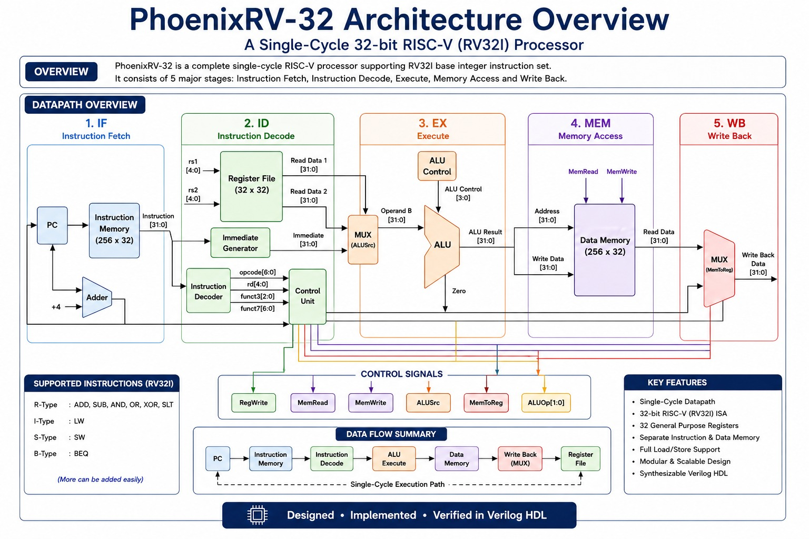
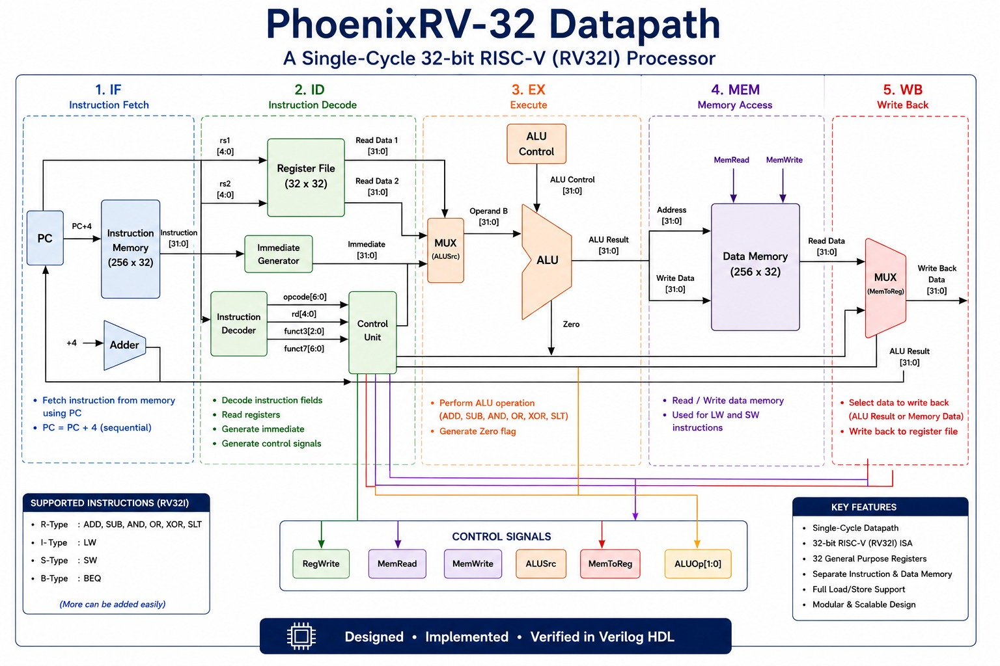
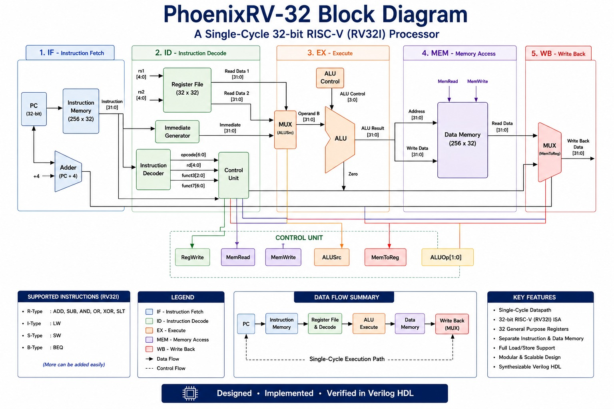
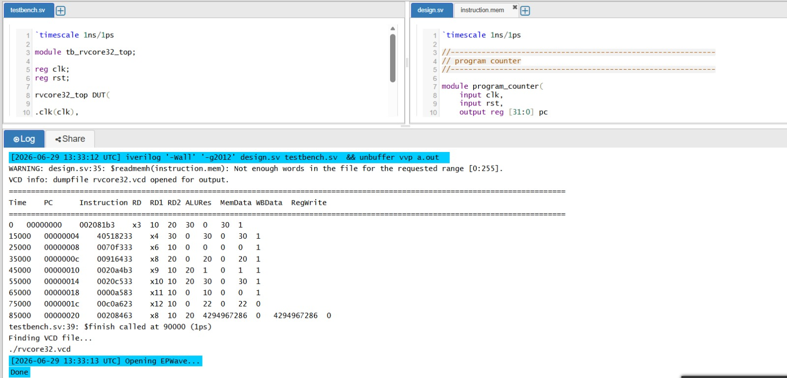
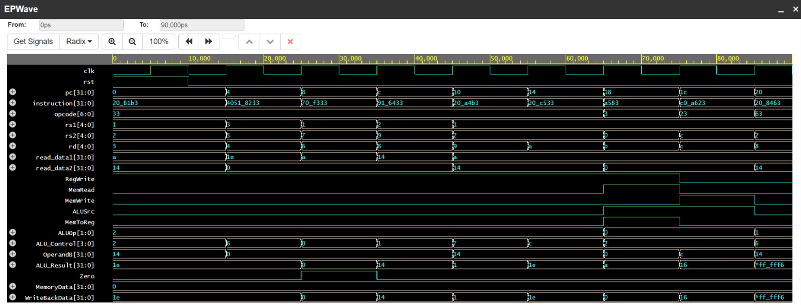

# PhoenixRV-32

### A 32-bit Single-Cycle RISC-V (RV32I) Processor Designed Using Verilog HDL


---

## 📖 Overview

PhoenixRV-32 is a **32-bit Single-Cycle RISC-V (RV32I) Processor** designed and implemented using **Verilog HDL**. The processor follows the **Harvard Architecture**, using separate instruction and data memories, and executes each instruction in a single clock cycle.

The project was developed to understand processor architecture, RTL design, datapath implementation, and hardware verification. Every major processor block was designed as an independent RTL module and integrated into a complete processor core.

---

## 🚀 Features

- 32-bit Single-Cycle Processor
- RISC-V RV32I Base ISA
- Harvard Architecture
- Modular RTL Design
- 32 General Purpose Registers
- Separate Instruction & Data Memory
- Functional Simulation using Icarus Verilog
- Waveform Verification using EPWave
- Synthesizable Verilog HDL Design

---

## 🏗 Processor Specifications

| Parameter          | Value                 |
| ------------------ | --------------------- |
| Processor Name     | PhoenixRV-32          |
| ISA                | RV32I                 |
| Architecture       | Harvard, Single-Cycle |
| Data Width         | 32-bit                |
| Register Count     | 32                    |
| Instruction Memory | 256 × 32-bit          |
| Data Memory        | 256 × 32-bit          |
| HDL                | Verilog HDL           |
| Simulator          | Icarus Verilog        |
| Waveform Viewer    | EPWave                |

---

# 🖼 Architecture Overview



---

# 📊 Processor Datapath



---

# 🧩 Processor Block Diagram



---

# 📂 Project Structure

```
PhoenixRV-32/
│
├── rtl/
│   ├── program_counter.v
│   ├── instruction_memory.v
│   ├── decoder.v
│   ├── register_file.v
│   ├── control_unit.v
│   ├── immediate_generator.v
│   ├── alu.v
│   ├── alu_control.v
│   ├── data_memory.v
│   ├── wb_stage.v
│   └── rvcore32_top.v
│
├── testbench/
│   └── tb_rvcore32_top.v
│
├── memory/
│   └── instruction.mem
│
├── diagrams/
│
├── waveforms/
│
├── docs/
│   └── PhoenixRV-32_Project_Report.pdf
│
├── README.md
├── LICENSE
└── .gitignore
```

---

# ⚙ Supported Instructions

### R-Type

- ADD
- SUB
- AND
- OR
- XOR
- SLT

### I-Type

- LW

### S-Type

- SW

### B-Type

- BEQ

---

# 🔄 Processor Execution Stages

1. Instruction Fetch (IF)
2. Instruction Decode (ID)
3. Execute (EX)
4. Memory Access (MEM)
5. Write Back (WB)

---

# 🧠 Major RTL Modules

- Program Counter
- Instruction Memory
- Instruction Decoder
- Register File
- Immediate Generator
- Control Unit
- ALU Control
- Arithmetic Logic Unit
- Data Memory
- Write Back Stage

---

# 🖥 Simulation

The processor was verified using:

- Icarus Verilog
- EPWave

Simulation validates:

- Program Counter Operation
- Instruction Fetch
- Instruction Decode
- ALU Execution
- Memory Read/Write
- Register Write Back
- Control Signal Generation

---

# 📈 Waveform

> Add the EPWave simulation screenshot here.




---

# 📄 Documentation

A complete technical report is available in:

```
docs/PhoenixRV-32_Project_Report.pdf
```

---

# 🔮 Future Enhancements

- Five-Stage Pipeline
- Hazard Detection Unit
- Data Forwarding
- Branch Prediction
- Cache Memory
- UART Interface
- Interrupt Handling
- RV32M Extension
- FPGA Implementation
- Performance Optimization

---

# 👨‍💻 Author

**Shanmukh Patnala**

Bachelor of Technology (Electronics and Communication Engineering)

Independent RTL & Processor Design Project

---

## ⭐ If you found this project useful, consider giving it a Star!
